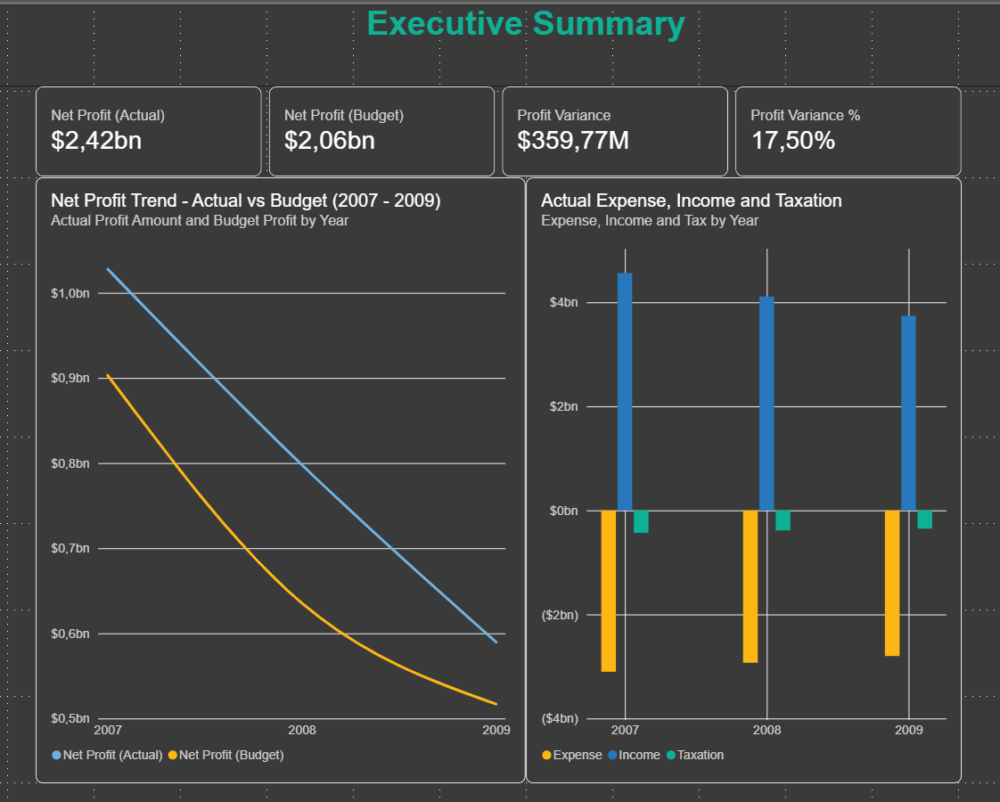
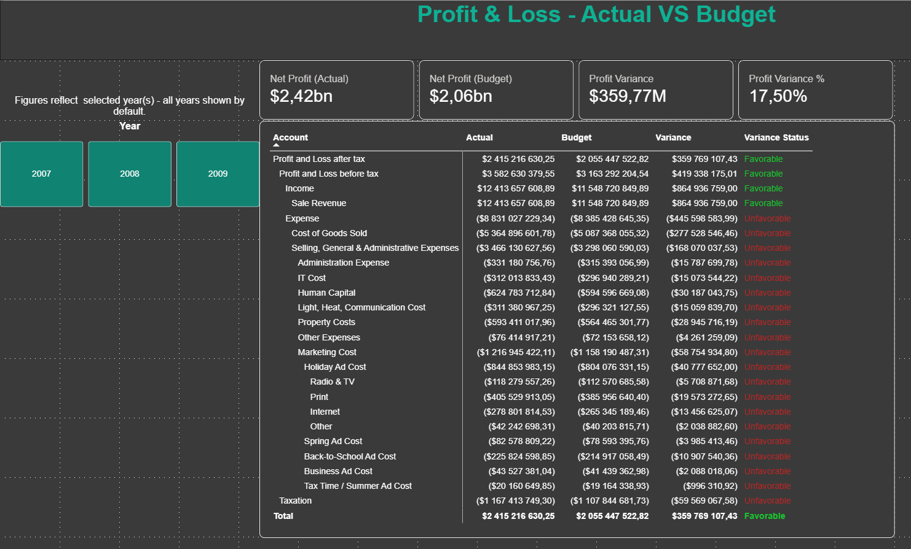

# Contoso Finance Dashboard

A CFO-style finance dashboard built in Power BI, using the Contoso 
(ContosoRetailDW) sample database. The project covers Profit & Loss 
reporting, Budget vs Actual variance, and multi-year trend analysis, 
with a parent-child account hierarchy modeled using DAX.

## Business Questions

This dashboard was built to answer the questions a CFO would actually 
ask of a P&L:

- What is the company's net profit, and how does it compare to budget?
- Which accounts are over or under budget, and by how much?
- Is profit trending up or down over time, and why?
- Is any profit decline driven by falling revenue, rising costs, or both?

## Key Findings

- **Net profit declined every year from 2007 to 2009** — roughly $1.03bn 
  (2007) → $800M (2008) → $590M (2009), a drop of about 22% then 26%.
- **The decline was driven by falling revenue, not rising costs.** 
  Income fell each year while Expense stayed roughly flat — visible in 
  the Income vs Expense breakdown on the Executive Summary page.
- **Actual consistently outperformed Budget** across all three years, 
  despite the downward trend — the business beat its own plan even as 
  the plan itself anticipated tougher years.
- **2009 Actual profit was $2.42bn against a Budget of $2.06bn** 
  (+17.5%), with every expense line running over budget but revenue 
  outperforming by enough to offset it.

## Dashboard

### Page 1 — Executive Summary


Net profit trend (Actual vs Budget, 2007–2009) and an Income/Expense 
breakdown by year, giving a five-second read on overall performance.

### Page 2 — P&L: Actual vs Budget


A 7-level drill-down account hierarchy (Profit and Loss after tax → 
Income/Expense → sub-categories) with Actual, Budget, Variance, and a 
Favorable/Unfavorable status for every account.

## Data Source

- **ContosoRetailDW** (SQL Server Express)
- Primary fact table: `dbo.FactStrategyPlan`
- Supporting dimensions: `dbo.DimAccount` (chart of accounts, 7-level 
  parent-child hierarchy), `dbo.DimScenario` (Actual / Budget / Forecast), 
  a custom `DimDate` built in DAX
- Scope was deliberately narrowed to finance-only: sales-related tables 
  and fields (`EntityKey`, `CurrencyKey`, `ProductCategoryKey`) were 
  dropped to keep the model focused on the P&L story
- See [data-dictionary.md](data-dictionary.md) for full schema notes

## Repository Structure
```
contoso-finance-dashboard/
├── README.md
├── data-dictionary.md
├── screenshots/            → dashboard page screenshots
├── sql/                    → exploration and validation queries
│   ├── 01_explore_dimaccount.sql
│   ├── 02_explore_factstrategyplan.sql
│   ├── 03_factstrategyplan_date_range.sql
│   ├── 04_dimscenario_values.sql
│   ├── 05_currencykey_count.sql
│   ├── 06_account_hierarchy_depth.sql
│   ├── 07_validate_net_profit_actual.sql
│   └── 08_validate_net_profit_budget.sql
└── powerbi/
    └── contoso-finance-dashboard.pbix
```

## Key Modeling Decisions

- **Built a custom `DimDate`** using DAX `CALENDAR()` rather than 
  importing the source date table, to match the fact table's exact 
  2007–2009 date range (confirmed via SQL first).
- **Flattened `DimAccount`'s parent-child hierarchy** (7 levels deep, 
  confirmed via a recursive CTE in SQL) into explicit `Level1`–`Level7` 
  name columns using `PATH()`, `PATHITEM()`, and `LOOKUPVALUE()`, 
  enabling a true drill-down hierarchy in the report.
- **Built a cumulative sign-flip** (`CumulativeSign`) that multiplies 
  every ancestor account's +/- operator together, so Expense and 
  Taxation genuinely subtract from Income at every level of the 
  hierarchy — not just at the leaf level. This was a real bug caught 
  and fixed mid-build (see Validation below).
- Validated data assumptions directly in SQL before modeling — the 
  fact table's date range, the single-currency assumption, and the 
  distinct scenario values were all confirmed via query, not assumed.

## Validation

The signed Net Profit figures in Power BI were independently verified 
against SQL Server, using a recursive CTE that reproduces the same 
cumulative sign-flip logic directly in SQL (`sql/07` and `sql/08`):

| Scenario | Power BI | SQL (independent) | Match |
|----------|----------|--------------------|---|
| Actual   | $2,415,216,630.25 | $2,415,216,630.2485 | ✅ |
| Budget   | $2,055,447,522.82 | $2,055,447,522.8182 | ✅ |

## Tools

- SQL Server (data exploration, validation, recursive CTEs)
- Power BI (data modeling, DAX, dashboard build)

## Status

✅ Both pages complete. Possible future additions: a Cash Flow page, 
AR Aging, and a Sales Performance page (using `FactSales`, `DimProduct`, 
`DimStore`).